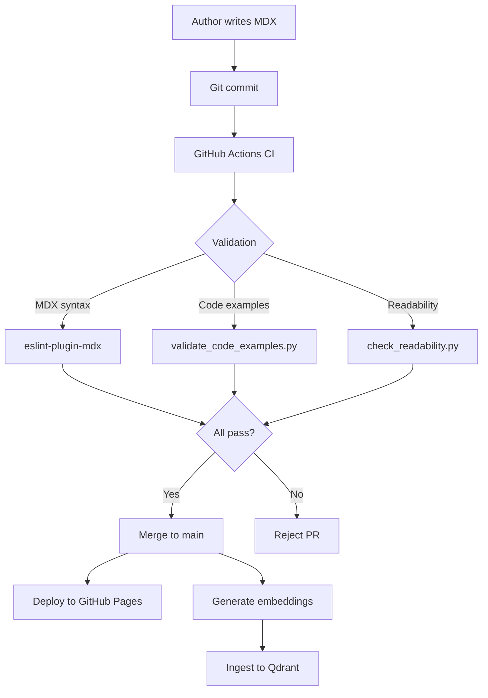

# Data Model: Physical AI & Humanoid Robotics Textbook

**Date**: 2025-12-06
**Phase**: 1 (Design & Contracts)
**Input**: Feature specification (spec.md) + Research findings (research.md)

## Overview

This document defines the data models and entities for the AI-native textbook system, including:
1. **Content Entities** - Module, Section, CodeExample, Diagram
2. **RAG Entities** - EmbeddingChunk, ChatQuery, ChatResponse
3. **Metadata Entities** - Citation, Asset, ReadabilityMetrics

---

## 1. Content Entities

### Module

Represents a top-level learning unit (e.g., "ROS 2", "Digital Twin", "Isaac", "VLA")

**Attributes**:
- `id`: string (e.g., "module-01-ros2")
- `title`: string (e.g., "Module 1: The Robotic Nervous System (ROS 2)")
- `position`: integer (1-4, for ordering)
- `description`: string (short summary for sidebar)
- `sections`: Section[] (6-10 sections per module)
- `word_count`: integer (calculated from all sections)
- `estimated_reading_time`: integer (minutes, calculated)

**Validation Rules**:
- `word_count` must be 9,000-25,000 (6-10 sections × 1,500-2,500 words)
- `sections.length` must be 6-10
- `position` must be unique across all modules

**Storage**: File system (`docs/module-{id}/`)

### Section

Represents an individual chapter/page within a module

**Attributes**:
- `id`: string (e.g., "01-nodes-topics")
- `module_id`: string (foreign key to Module)
- `title`: string (e.g., "ROS 2 Nodes and Topics")
- `file_path`: string (e.g., "docs/module-01-ros2/01-nodes-topics.mdx")
- `position`: integer (ordering within module)
- `content`: string (MDX content)
- `frontmatter`: object (YAML metadata)
- `word_count`: integer
- `flesch_kincaid_grade`: float
- `code_examples`: CodeExample[]
- `diagrams`: Diagram[]
- `citations`: Citation[]
- `created_at`: datetime
- `updated_at`: datetime

**Validation Rules**:
- `word_count` must be 1,500-2,500
- `flesch_kincaid_grade` must be 8.0-12.0
- `code_examples.length` >= 1 (minimum 30% hands-on content)
- `citations.length` >= 3 (technical accuracy requirement)

**Storage**: File system (MDX files) + Neon Postgres (metadata)

**Neon Postgres Schema**:
```sql
CREATE TABLE sections (
  id VARCHAR(100) PRIMARY KEY,
  module_id VARCHAR(100) NOT NULL,
  title VARCHAR(255) NOT NULL,
  file_path VARCHAR(500) NOT NULL,
  position INTEGER NOT NULL,
  word_count INTEGER NOT NULL,
  flesch_kincaid_grade DECIMAL(3,1),
  created_at TIMESTAMP DEFAULT NOW(),
  updated_at TIMESTAMP DEFAULT NOW(),
  CONSTRAINT fk_module FOREIGN KEY (module_id) REFERENCES modules(id),
  CONSTRAINT word_count_range CHECK (word_count BETWEEN 1500 AND 2500),
  CONSTRAINT readability_range CHECK (flesch_kincaid_grade BETWEEN 8.0 AND 12.0)
);

CREATE INDEX idx_sections_module ON sections(module_id);
```

### CodeExample

Represents a runnable code snippet embedded in section content

**Attributes**:
- `id`: string (auto-generated UUID)
- `section_id`: string (foreign key to Section)
- `language`: string (e.g., "python", "bash", "yaml")
- `code`: string (actual code content)
- `line_number`: integer (position in source file)
- `is_runnable`: boolean (marked with "runnable" metadata)
- `version_info`: object (e.g., `{"python": "3.10", "ros2": "humble"}`)
- `description`: string (inline comment or caption)
- `syntax_valid`: boolean (AST check result)
- `execution_status`: enum ("not_tested", "pass", "fail")
- `execution_output`: string (stdout/stderr from test)

**Validation Rules**:
- `syntax_valid` must be `true` (enforced by CI/CD)
- If `is_runnable == true`, `execution_status` must be "pass"
- `version_info` must include relevant version specifications

**Storage**: Neon Postgres (metadata), inline in MDX files (content)

### Diagram

Represents a Mermaid or SVG diagram embedded in section content

**Attributes**:
- `id`: string (auto-generated UUID)
- `section_id`: string (foreign key to Section)
- `type`: enum ("mermaid", "svg", "png", "jpg")
- `source_path`: string (file path or inline Mermaid code)
- `alt_text`: string (accessibility description)
- `caption`: string (diagram caption)
- `file_size_kb`: integer (for assets)
- `is_valid`: boolean (syntax/rendering check)

**Validation Rules**:
- If `type == "mermaid"`, must validate with mermaid-cli
- If `type` in ["svg", "png", "jpg"], `file_size_kb` must be < 500
- `alt_text` is required (accessibility)

**Storage**: File system (assets/) + Neon Postgres (metadata)

---

## 2. RAG Entities

### EmbeddingChunk

Represents a text segment embedded for vector search

**Attributes**:
- `id`: string (UUID)
- `section_id`: string (foreign key to Section)
- `chunk_index`: integer (position within section, 0-based)
- `text`: string (200-300 words, with 50-word overlap)
- `embedding_vector`: float[] (384 dimensions, from all-MiniLM-L6-v2)
- `word_count`: integer
- `start_char_offset`: integer (position in original section)
- `end_char_offset`: integer
- `metadata`: object (module, section, heading level, type: "text"|"code"|"explanation")
- `created_at`: datetime

**Chunking Strategy**:
- **Chunk size**: 200-300 words
- **Overlap**: 50 words (preserves context across chunk boundaries)
- **Preserve boundaries**: Code blocks not split mid-block
- **Metadata enrichment**: Include module, section, heading level for citation resolution

**Validation Rules**:
- `word_count` must be 150-350 (200-300 target with tolerance)
- `embedding_vector.length` must be 384
- `text` must not start/end mid-sentence (sentence boundary detection)

**Storage**:
- Vector: Qdrant (collection: "textbook_chunks")
- Metadata: Neon Postgres

**Qdrant Schema**:
```python
from qdrant_client.models import Distance, VectorParams

collection_config = VectorParams(
    size=384,
    distance=Distance.COSINE
)

# Payload structure
payload = {
    "chunk_id": "uuid-string",
    "section_id": "01-nodes-topics",
    "module_id": "module-01-ros2",
    "text": "ROS 2 uses a publish-subscribe...",
    "word_count": 245,
    "chunk_index": 0,
    "heading": "Introduction to ROS 2 Topics",
    "chunk_type": "text"  # or "code" or "explanation"
}
```

**Neon Postgres Schema**:
```sql
CREATE TABLE embedding_chunks (
  id UUID PRIMARY KEY DEFAULT gen_random_uuid(),
  section_id VARCHAR(100) NOT NULL,
  chunk_index INTEGER NOT NULL,
  text TEXT NOT NULL,
  word_count INTEGER NOT NULL,
  start_char_offset INTEGER NOT NULL,
  end_char_offset INTEGER NOT NULL,
  metadata JSONB,
  created_at TIMESTAMP DEFAULT NOW(),
  FOREIGN KEY (section_id) REFERENCES sections(id),
  CONSTRAINT unique_chunk UNIQUE (section_id, chunk_index)
);

CREATE INDEX idx_chunks_section ON embedding_chunks(section_id);
```

### ChatQuery

Represents a user question sent to the RAG chatbot

**Attributes**:
- `id`: string (UUID)
- `user_id`: string (optional, for analytics)
- `query_text`: string (user's natural language question)
- `selected_text`: string (optional, text selected by user via "Ask AI")
- `context_section_id`: string (optional, current page/section)
- `query_embedding`: float[] (384 dimensions, from all-MiniLM-L6-v2)
- `top_k`: integer (number of chunks to retrieve, default 3)
- `timestamp`: datetime
- `response_id`: string (foreign key to ChatResponse)

**Validation Rules**:
- `query_text` length >= 10 characters
- `top_k` must be 1-10
- `query_embedding.length` must be 384

**Storage**: Neon Postgres

**Schema**:
```sql
CREATE TABLE chat_queries (
  id UUID PRIMARY KEY DEFAULT gen_random_uuid(),
  user_id VARCHAR(100),
  query_text TEXT NOT NULL,
  selected_text TEXT,
  context_section_id VARCHAR(100),
  top_k INTEGER DEFAULT 3,
  timestamp TIMESTAMP DEFAULT NOW(),
  CONSTRAINT query_length CHECK (LENGTH(query_text) >= 10),
  CONSTRAINT topk_range CHECK (top_k BETWEEN 1 AND 10)
);

CREATE INDEX idx_queries_timestamp ON chat_queries(timestamp DESC);
CREATE INDEX idx_queries_user ON chat_queries(user_id);
```

### ChatResponse

Represents the RAG chatbot's answer to a user query

**Attributes**:
- `id`: string (UUID)
- `query_id`: string (foreign key to ChatQuery)
- `response_text`: string (generated answer)
- `retrieved_chunks`: RetrievedChunk[] (top-k chunks from vector search)
- `citations`: SectionCitation[] (links to specific textbook sections)
- `confidence_score`: float (0.0-1.0, based on cosine similarity)
- `generation_time_ms`: integer (latency tracking)
- `timestamp`: datetime

**Sub-Entity: RetrievedChunk**:
```typescript
interface RetrievedChunk {
  chunk_id: string;
  section_id: string;
  module_id: string;
  text: string;
  similarity_score: float;  // Cosine similarity (0.0-1.0)
  rank: integer;            // 1, 2, 3, ... top_k
}
```

**Sub-Entity: SectionCitation**:
```typescript
interface SectionCitation {
  section_id: string;
  section_title: string;
  module_id: string;
  module_title: string;
  url: string;  // Relative URL to section (e.g., "/docs/module-01-ros2/01-nodes-topics")
  excerpt: string;  // Brief quote from section
}
```

**Validation Rules**:
- `retrieved_chunks.length` must equal query's `top_k`
- `citations.length` >= 1 (must cite at least one section)
- `confidence_score` based on top-1 similarity score
- `generation_time_ms` <= 2000 (meets <2s response target)

**Storage**: Neon Postgres

**Schema**:
```sql
CREATE TABLE chat_responses (
  id UUID PRIMARY KEY DEFAULT gen_random_uuid(),
  query_id UUID NOT NULL,
  response_text TEXT NOT NULL,
  retrieved_chunks JSONB NOT NULL,
  citations JSONB NOT NULL,
  confidence_score DECIMAL(3,2),
  generation_time_ms INTEGER,
  timestamp TIMESTAMP DEFAULT NOW(),
  FOREIGN KEY (query_id) REFERENCES chat_queries(id),
  CONSTRAINT response_time CHECK (generation_time_ms <= 5000),
  CONSTRAINT confidence_range CHECK (confidence_score BETWEEN 0.0 AND 1.0)
);

CREATE INDEX idx_responses_query ON chat_responses(query_id);
```

---

## 3. Metadata Entities

### Citation

Represents an external reference cited in section content

**Attributes**:
- `id`: string (UUID)
- `section_id`: string (foreign key to Section)
- `title`: string (citation title or description)
- `url`: string (external link)
- `type`: enum ("official_docs", "research_paper", "tutorial", "api_reference")
- `inline_text`: string (link anchor text from MDX)
- `position_in_section`: integer (occurrence order)
- `is_valid_url`: boolean (link checker result)
- `last_checked`: datetime

**Validation Rules**:
- `url` must be valid HTTP/HTTPS
- `title` is required
- Each section must have >= 3 citations (constitution requirement)

**Storage**: Neon Postgres

### Asset

Represents an image, diagram, or downloadable resource

**Attributes**:
- `id`: string (UUID)
- `file_path`: string (e.g., "static/assets/images/ros2-architecture.png")
- `file_type`: enum ("png", "jpg", "svg", "webp", "pdf")
- `file_size_kb`: integer
- `width_px`: integer
- `height_px`: integer
- `alt_text`: string
- `used_in_sections`: string[] (array of section IDs)
- `optimized`: boolean (has been compressed/optimized)

**Validation Rules**:
- `file_size_kb` must be < 500 (constitution constraint)
- `alt_text` is required (accessibility)
- If `file_type` in ["png", "jpg"], must be optimized to WebP

**Storage**: File system (static/assets/) + Neon Postgres (metadata)

### ReadabilityMetrics

Represents readability analysis results for a section

**Attributes**:
- `section_id`: string (primary key, foreign key to Section)
- `word_count`: integer
- `sentence_count`: integer
- `avg_sentence_length`: float
- `flesch_kincaid_grade`: float
- `flesch_reading_ease`: float
- `smog_index`: float
- `gunning_fog`: float
- `dale_chall_score`: float
- `calculated_at`: datetime
- `passes_requirements`: boolean (FK grade 8-12)

**Validation Rules**:
- `flesch_kincaid_grade` must be 8.0-12.0 for `passes_requirements == true`
- Metrics recalculated on every content update

**Storage**: Neon Postgres

---

## 4. Entity Relationships

```
Module (1) ─────has many────> Section (M)
Section (1) ─────has many────> CodeExample (M)
Section (1) ─────has many────> Diagram (M)
Section (1) ─────has many────> Citation (M)
Section (1) ─────has many────> EmbeddingChunk (M)
Section (1) ─────has one─────> ReadabilityMetrics (1)

EmbeddingChunk (M) ────retrieved by────> ChatQuery (1)
ChatQuery (1) ──────produces──────> ChatResponse (1)
ChatResponse (1) ───cites───> Section (M)
```

---

## 5. Data Flow Diagrams

### Content Authoring Flow



### RAG Query Flow

```mermaid
graph LR
    A[User selects text] --> B[Click 'Ask AI']
    B --> C[Generate query embedding]
    C --> D[Qdrant vector search]
    D --> E[Retrieve top-k chunks]
    E --> F[Resolve section citations]
    F --> G[Generate response]
    G --> H[Return answer + citations]
    H --> I[Display to user]
```



---

## 6. Storage Estimates

### Neon Postgres (Free Tier: 512 MB storage)

| Table | Rows | Avg Row Size | Total Size |
|-------|------|--------------|------------|
| modules | 4 | 500 bytes | 2 KB |
| sections | 32 | 1 KB | 32 KB |
| code_examples | 80 | 2 KB | 160 KB |
| diagrams | 40 | 500 bytes | 20 KB |
| citations | 150 | 300 bytes | 45 KB |
| embedding_chunks (metadata only) | 367 | 500 bytes | 184 KB |
| chat_queries | 10,000 | 300 bytes | 3 MB |
| chat_responses | 10,000 | 1 KB | 10 MB |
| **Total** | | | **~13.5 MB** (3% of free tier) |

### Qdrant (Free Tier: 1 GB storage)

| Data | Count | Size per Item | Total Size |
|------|-------|---------------|------------|
| Embedding vectors (367 chunks × 384 dims × 4 bytes) | 367 | 1.5 KB | 564 KB |
| Payload metadata (JSON) | 367 | 100 bytes | 36 KB |
| **Total** | | | **~600 KB** (60% of free tier) |

**Conclusion**: Both Neon and Qdrant free tiers are comfortably within limits with significant headroom.

---

## 7. API Models (for contracts/)

See `contracts/rag-api.yaml` for full OpenAPI specification. Key models:

**QueryRequest**:
```json
{
  "query": "How do ROS 2 topics work?",
  "selected_text": "publish-subscribe architecture",
  "context_section": "/docs/module-01-ros2/01-nodes-topics",
  "top_k": 3
}
```

**QueryResponse**:
```json
{
  "response": "ROS 2 topics use a publish-subscribe architecture...",
  "citations": [
    {
      "section_id": "01-nodes-topics",
      "section_title": "ROS 2 Nodes and Topics",
      "module_title": "Module 1: ROS 2",
      "url": "/docs/module-01-ros2/01-nodes-topics",
      "excerpt": "Topics enable asynchronous communication..."
    }
  ],
  "confidence": 0.87,
  "response_time_ms": 1250
}
```

---

## 8. Data Quality Constraints

| Constraint | Enforcement | Tool |
|------------|-------------|------|
| Section word count 1,500-2,500 | CI/CD | Python script |
| Flesch-Kincaid Grade 8-12 | CI/CD | textstat |
| Code syntax validity | CI/CD | AST parser |
| Asset size <500KB | CI/CD | File size check |
| Minimum 3 citations per section | CI/CD | Citation counter |
| No broken links | CI/CD (optional) | textlint no-dead-link |
| Terminology consistency | Pre-commit | Vale |

---

## 9. Next Steps

1. Create OpenAPI specification in `contracts/rag-api.yaml`
2. Implement Neon Postgres schema creation SQL
3. Implement Qdrant collection initialization
4. Generate quickstart.md with setup instructions
5. Proceed to Phase 2: Tasks generation (`/sp.tasks`)

**Phase 1 Status**: Data model complete - ready for contracts and quickstart
