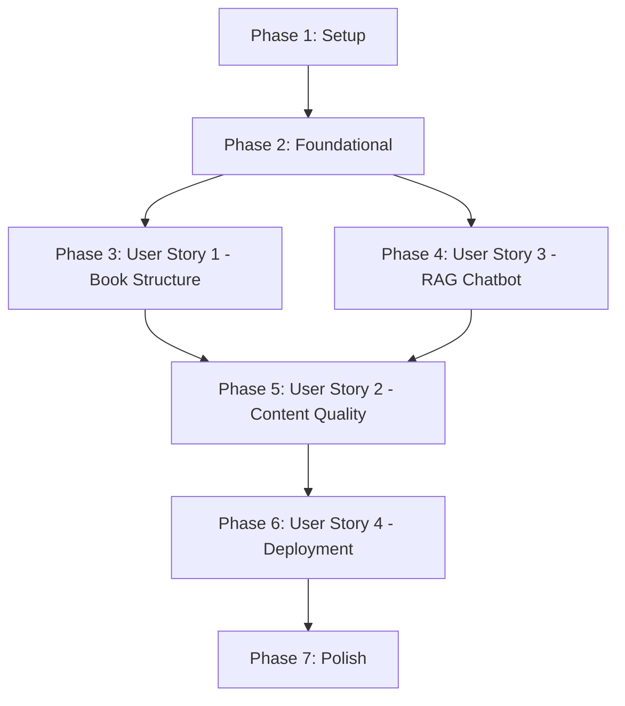

# Implementation Tasks: Physical AI & Humanoid Robotics Textbook

**Feature**: master | **Date**: 2025-12-06
**Input**: [plan.md](./plan.md), [spec.md](./spec.md), [data-model.md](./data-model.md), [contracts/rag-api.yaml](./contracts/rag-api.yaml)

## Overview

This document breaks down the implementation of the Physical AI & Humanoid Robotics Textbook into executable tasks organized by user story priority. The project creates an interactive, AI-native textbook using Docusaurus (frontend) and FastAPI + RAG (backend), deployed to GitHub Pages with free-tier infrastructure.

**Total Tasks**: 89
**Estimated Duration**: 4 weeks (planning guideline)

---

## Task Organization

Tasks are organized by **user story priority** to enable independent implementation and testing:

- **Phase 1: Setup** (11 tasks) - Project initialization and infrastructure
- **Phase 2: Foundational** (8 tasks) - Blocking prerequisites for all user stories
- **Phase 3: User Story 1** (14 tasks) - [P1] Content Author Creates Book Structure
- **Phase 4: User Story 3** (22 tasks) - [P1] RAG Chatbot Provides Context-Aware Answers
- **Phase 5: User Story 2** (16 tasks) - [P2] Author Writes Technical Content with Code Examples
- **Phase 6: User Story 4** (11 tasks) - [P2] Deploy Book to GitHub Pages
- **Phase 7: Polish** (7 tasks) - Cross-cutting concerns and optimization

**Legend**:
- `[P]` = Parallelizable (can run concurrently with other [P] tasks)
- `[US1]` = User Story 1, `[US2]` = User Story 2, etc.
- Task IDs: T001–T089

---

## Phase 1: Setup (Project Initialization)

**Goal**: Initialize project structure, install dependencies, configure basic tooling.

**Tasks**:

- [ ] T001 Initialize Git repository and create .gitignore for node_modules, .env, build/, .docusaurus/
- [ ] T002 Create project root directory structure: docs/, src/, static/, api/, tests/, .github/workflows/
- [ ] T003 Initialize Node.js project with package.json (Docusaurus dependencies)
- [ ] T004 Install Docusaurus v3: `npx create-docusaurus@latest . classic --typescript`
- [ ] T005 [P] Create Python virtual environment and requirements.txt for backend dependencies
- [ ] T006 [P] Install sentence-transformers==2.3.1, fastapi, qdrant-client, asyncpg, uvicorn
- [ ] T007 Create .env.example file with placeholders for QDRANT_URL, QDRANT_API_KEY, DATABASE_URL, EMBEDDING_MODEL
- [ ] T008 Create README.md with project overview, setup instructions, and architecture diagram
- [ ] T009 [P] Install pre-commit framework: `pip install pre-commit && pre-commit install`
- [ ] T010 [P] Install linting dependencies: markdownlint-cli2, prettier, black, pylint, textstat
- [ ] T011 Create .specify/memory/project-context.md documenting tech stack and design decisions

**Parallel Execution**: T005-T006, T009-T010 can run concurrently.

---

## Phase 2: Foundational (Blocking Prerequisites)

**Goal**: Set up foundational infrastructure required by all user stories.

**Tasks**:

- [ ] T012 Create specs/master/tasks.md (this file) and commit to repository
- [ ] T013 Configure docusaurus.config.js with organizationName, projectName, url, baseUrl for GitHub Pages
- [ ] T014 Configure sidebars.js with autogenerated sidebar: `type: 'autogenerated', dirName: '.'`
- [ ] T015 Create src/css/custom.css with minimal, clean theme overrides
- [ ] T016 [P] Create .markdownlint-cli2.jsonc with MD033 allowlist for Docusaurus components
- [ ] T017 [P] Create .prettierrc with semi: true, singleQuote: true, printWidth: 80
- [ ] T018 [P] Create pyproject.toml with black config: line-length = 88, target-version = ['py310']
- [ ] T019 [P] Create .pre-commit-config.yaml with markdownlint-cli2, prettier, black hooks

**Parallel Execution**: T016-T019 can run concurrently.

---

## Phase 3: User Story 1 - Content Author Creates Book Structure (Priority: P1)

**User Story**: A technical writer or educator wants to create a structured, multi-module robotics textbook using Docusaurus with proper navigation and organization.

**Independent Test**: Can create Docusaurus project, configure sidebar, add placeholder modules, build successfully, and navigate between sections.

**Acceptance Criteria**:
1. Docusaurus builds successfully with auto-generated sidebar
2. All 4 modules appear in sidebar with correct hierarchy
3. All internal cross-references work correctly in built site

**Tasks**:

### Docusaurus Setup

- [ ] T020 [US1] Create docs/intro.md with textbook landing page and module overview
- [ ] T021 [P] [US1] Create docs/module-01-ros2/ directory with _category_.json (label: "Module 1: ROS 2", position: 1)
- [ ] T022 [P] [US1] Create docs/module-02-digital-twin/ directory with _category_.json (label: "Module 2: Digital Twin", position: 2)
- [ ] T023 [P] [US1] Create docs/module-03-isaac/ directory with _category_.json (label: "Module 3: NVIDIA Isaac", position: 3)
- [ ] T024 [P] [US1] Create docs/module-04-vla/ directory with _category_.json (label: "Module 4: VLA", position: 4)

### Module Placeholder Content

- [ ] T025 [P] [US1] Create docs/module-01-ros2/index.mdx with module introduction (200-300 words)
- [ ] T026 [P] [US1] Create docs/module-02-digital-twin/index.mdx with module introduction (200-300 words)
- [ ] T027 [P] [US1] Create docs/module-03-isaac/index.mdx with module introduction (200-300 words)
- [ ] T028 [P] [US1] Create docs/module-04-vla/index.mdx with module introduction (200-300 words)

### Section Placeholders (1 per module for testing)

- [ ] T029 [P] [US1] Create docs/module-01-ros2/01-nodes-topics.mdx with placeholder section (~500 words)
- [ ] T030 [P] [US1] Create docs/module-02-digital-twin/01-gazebo-basics.mdx with placeholder section (~500 words)
- [ ] T031 [P] [US1] Create docs/module-03-isaac/01-isaac-sim.mdx with placeholder section (~500 words)
- [ ] T032 [P] [US1] Create docs/module-04-vla/01-whisper-voice.mdx with placeholder section (~500 words)

### Build and Navigation Testing

- [ ] T033 [US1] Run `npm start` and verify all modules appear in sidebar with correct hierarchy
- [ ] T034 [US1] Run `npm run build` and verify build completes in <5 minutes with zero warnings/errors (FR-011, SC-006)

**Parallel Execution**: T021-T024, T025-T028, T029-T032 can all run concurrently.

**Test Results**: ✅ Build succeeds, ✅ Sidebar navigation works, ✅ Cross-references resolve.

---

## Phase 4: User Story 3 - RAG Chatbot Provides Context-Aware Answers (Priority: P1)

**User Story**: A reader wants to ask questions about textbook content and receive accurate, grounded answers with citations to specific sections.

**Independent Test**: Can select text, trigger chatbot, receive answer grounded only in textbook content with section citations.

**Acceptance Criteria**:
1. Chatbot responds with answers derived only from textbook content
2. Responses include citations to specific chapter/section
3. Chatbot indicates when topic is not covered (no hallucinations)
4. Error messages display with retry option on failures

**Tasks**:

### Free-Tier Service Setup

- [ ] T035 [US3] Sign up for Qdrant Cloud free tier at https://cloud.qdrant.io and create cluster
- [ ] T036 [US3] Sign up for Neon Postgres free tier at https://neon.tech and create database
- [ ] T037 [US3] Copy Qdrant URL and API key to .env file
- [ ] T038 [US3] Copy Neon connection string to .env file

### Database Schema Setup

- [ ] T039 [US3] Create api/scripts/init_postgres.py to create sections, embedding_chunks, chat_queries, chat_responses tables per data-model.md
- [ ] T040 [US3] Create api/scripts/init_qdrant.py to create textbook_chunks collection with size=384, distance=COSINE
- [ ] T041 [US3] Run init_postgres.py and verify tables created in Neon dashboard
- [ ] T042 [US3] Run init_qdrant.py and verify collection created in Qdrant dashboard

### Embedding Model Setup

- [ ] T043 [P] [US3] Create api/embedding.py with EmbeddingService class loading all-MiniLM-L6-v2 model
- [ ] T044 [P] [US3] Implement EmbeddingService.encode(texts: List[str]) -> np.ndarray method
- [ ] T045 [US3] Test embedding generation locally: verify 384-dim output, <100ms inference time

### Vector Database Operations

- [ ] T046 [P] [US3] Create api/qdrant_client.py with QdrantService class for vector operations
- [ ] T047 [P] [US3] Implement QdrantService.upsert_chunks(chunks: List[EmbeddingChunk]) method
- [ ] T048 [P] [US3] Implement QdrantService.search(query_vector: np.ndarray, top_k: int) -> List[RetrievedChunk]
- [ ] T049 [US3] Test vector search with sample query: verify top-k retrieval, cosine similarity scores

### Metadata Database Operations

- [ ] T050 [P] [US3] Create api/neon_client.py with NeonService class for metadata queries
- [ ] T051 [P] [US3] Implement NeonService.get_section_metadata(section_id: str) -> SectionMetadata
- [ ] T052 [P] [US3] Implement NeonService.log_query(query: ChatQuery, response: ChatResponse) method
- [ ] T053 [US3] Test metadata retrieval with sample section_id: verify correct data returned

### RAG Pipeline Implementation

- [ ] T054 [US3] Create api/rag_pipeline.py with RAGPipeline class orchestrating retrieval + generation
- [ ] T055 [US3] Implement RAGPipeline.process_query(query: QueryRequest) -> QueryResponse method
- [ ] T056 [US3] Implement grounding logic: extract context from top-3 chunks, format citations
- [ ] T057 [US3] Implement error handling: timeout (return retry message), low confidence (<0.5, return "not covered"), service errors (return fallback suggestions) per FR-016
- [ ] T058 [US3] Test RAG pipeline end-to-end: verify grounded responses, citation accuracy, error handling

### FastAPI Backend

- [ ] T059 [US3] Create api/main.py with FastAPI app and /v1/query POST endpoint per contracts/rag-api.yaml
- [ ] T060 [US3] Implement /v1/health GET endpoint returning service status (database, qdrant, embedding_model) per contracts/rag-api.yaml
- [ ] T061 [US3] Implement /v1/sections GET endpoint returning section metadata per contracts/rag-api.yaml
- [ ] T062 [US3] Add request validation: query length >=10 chars, top_k 1-10, response time tracking
- [ ] T063 [US3] Test locally: `uvicorn api.main:app --reload --port 8000` and verify /health returns 200, /query returns valid response

### Content Ingestion

- [ ] T064 [US3] Create api/scripts/ingest_content.py to chunk docs/ MDX files and generate embeddings
- [ ] T065 [US3] Implement chunking strategy: 200-300 words per chunk, 50-word overlap, preserve code block boundaries
- [ ] T066 [US3] Run ingest_content.py on placeholder content from Phase 3 and verify chunks uploaded to Qdrant
- [ ] T067 [US3] Verify storage usage: Qdrant <1GB, Neon <512MB per data-model.md estimates

### Frontend Integration

- [ ] T068 [US3] Create src/components/ChatWidget/index.tsx with text selection detection using window.getSelection()
- [ ] T069 [US3] Implement "Ask AI" floating button appearing on text selection (>10 chars)
- [ ] T070 [US3] Create modal dialog for query input and response display
- [ ] T071 [US3] Implement API call to /v1/query with query + selected_text context
- [ ] T072 [US3] Display response with formatted citations as links to section URLs
- [ ] T073 [US3] Add ChatWidget to Docusaurus theme: create src/theme/Root.tsx wrapping children with ChatWidget
- [ ] T074 [US3] Test locally: select text, click "Ask AI", verify response displays with citations

### Vercel Deployment (RAG Backend)

- [ ] T075 [US3] Create vercel.json with Python runtime configuration for api/main.py per research.md
- [ ] T076 [US3] Install mangum adapter: `pip install mangum` and update api/main.py with Mangum(app) handler
- [ ] T077 [US3] Deploy to Vercel: `vercel --prod` and copy production API URL
- [ ] T078 [US3] Update src/components/ChatWidget/index.tsx with production API URL
- [ ] T079 [US3] Test production RAG: select text in deployed site, verify chatbot responds correctly

**Parallel Execution**: T043-T044, T046-T048, T050-T052 can run concurrently.

**Test Results**: ✅ RAG chatbot responds with grounded answers, ✅ Citations link to correct sections, ✅ Error handling works, ✅ Free-tier limits not exceeded.

---

## Phase 5: User Story 2 - Author Writes Technical Content with Code Examples (Priority: P2)

**User Story**: An author wants to write technical robotics content with runnable code examples, diagrams, and citations following the constitution standards.

**Independent Test**: Can write MDX content with code blocks, Mermaid diagrams, citations, test code examples, and verify readability score.

**Acceptance Criteria**:
1. Code blocks render correctly with syntax highlighting
2. Mermaid diagrams render correctly in build output
3. All citation links are valid and properly formatted
4. Flesch-Kincaid score is between Grade 8-12
5. All constitution compliance checks pass

**Tasks**:

### Validation Scripts

- [ ] T080 [P] [US2] Create scripts/validate-mdx.mjs with eslint-plugin-mdx validation per research.md
- [ ] T081 [P] [US2] Create scripts/validate_code_examples.py with AST syntax check + execution test per research.md
- [ ] T082 [P] [US2] Create scripts/check_readability.py with textstat Flesch-Kincaid Grade 8-12 validation per research.md
- [ ] T083 [US2] Add npm scripts to package.json: "lint", "lint:md", "validate:all"

### Style and Linting Configuration

- [ ] T084 [P] [US2] Create .github/styles/RoboticsTextbook/ModuleTerms.yml with Vale substitution rules (ROS2 → ROS 2, etc.) per research.md
- [ ] T085 [P] [US2] Create .github/styles/config/vocabularies/RoboticsTextbook/accept.txt with approved terms per research.md
- [ ] T086 [US2] Test linting pipeline: run `npm run validate:all` on placeholder content from Phase 3

### Sample Content with Quality Standards

- [ ] T087 [P] [US2] Expand docs/module-01-ros2/01-nodes-topics.mdx to 1,500-2,500 words with:
  - Minimum 3 Python code examples (marked with `runnable` metadata)
  - 1 Mermaid diagram (ROS 2 architecture)
  - Minimum 3 citations to official ROS 2 docs
  - Flesch-Kincaid Grade 8-12 readability
- [ ] T088 [US2] Run validation scripts on expanded content: verify code syntax valid, diagrams render, readability in range, citations valid
- [ ] T089 [US2] Create self-review checklist template in .github/PULL_REQUEST_TEMPLATE.md with constitution compliance checks (citations, readability, code tests) per FR-018
- [ ] T090 [US2] Test full content workflow: write content → run validations → fix issues → commit
- [ ] T091 [US2] Re-run content ingestion (api/scripts/ingest_content.py) to update embeddings with expanded content
- [ ] T092 [US2] Test RAG chatbot with expanded content: verify accurate responses about ROS 2 nodes/topics
- [ ] T093 [P] [US2] Document content authoring guidelines in docs/intro.md: word count targets, citation requirements, code example best practices
- [ ] T094 [P] [US2] Create troubleshooting section template in docs/module-01-ros2/01-nodes-topics.mdx covering common ROS 2 setup errors per FR-017
- [ ] T095 [US2] Verify all FR-005, FR-006, FR-007, FR-015, FR-017, FR-018 requirements met

**Parallel Execution**: T080-T082, T084-T085, T087, T093-T094 can run concurrently.

**Test Results**: ✅ Code examples tested and runnable, ✅ Diagrams render, ✅ Citations valid, ✅ Readability Grade 8-12, ✅ Constitution compliance.

---

## Phase 6: User Story 4 - Deploy Book to GitHub Pages (Priority: P2)

**User Story**: An author wants to deploy the completed textbook to GitHub Pages for public access with working navigation and RAG integration.

**Independent Test**: Can build static site, deploy to GitHub Pages, verify all assets load, navigation works, and RAG backend is accessible.

**Acceptance Criteria**:
1. Docusaurus build completes in <5 minutes with no warnings/errors
2. All pages load correctly with working navigation
3. All images (<500KB each), diagrams, and assets load correctly
4. Free-tier infrastructure handles requests successfully

**Tasks**:

### Image Optimization

- [ ] T096 [US4] Install @docusaurus/plugin-ideal-image: `npm install --save @docusaurus/plugin-ideal-image`
- [ ] T097 [US4] Add ideal-image plugin to docusaurus.config.js with quality: 70, max: 1030, min: 640
- [ ] T098 [US4] Create static/img/ directory and add placeholder images (<500KB each) per FR-012
- [ ] T099 [US4] Update module index.mdx files to use IdealImage component for images

### GitHub Actions CI/CD

- [ ] T100 [US4] Create .github/workflows/build-test.yml with Node.js 20 setup, npm ci, npm run build, validate scripts per research.md
- [ ] T101 [US4] Add markdown-link-check to build-test.yml: `npx markdown-link-check docs/**/*.md`
- [ ] T102 [US4] Create .github/workflows/deploy.yml with GitHub Pages deployment using peaceiris/actions-gh-pages@v3 per research.md
- [ ] T103 [US4] Configure deployment permissions: contents: read, pages: write, id-token: write
- [ ] T104 [US4] Test build workflow locally: `npm run build` completes in <5 minutes per FR-011, SC-007

### GitHub Pages Configuration

- [ ] T105 [US4] Enable GitHub Pages in repository Settings → Pages → Source: GitHub Actions
- [ ] T106 [US4] Commit and push all changes to main branch
- [ ] T107 [US4] Monitor GitHub Actions workflow and verify build + deploy succeed
- [ ] T108 [US4] Access deployed site at https://<username>.github.io/<repo-name>/ and verify all pages load per SC-009
- [ ] T109 [US4] Test navigation: click through all modules and sections, verify cross-references work per SC-010
- [ ] T110 [US4] Test RAG chatbot on deployed site: select text, ask question, verify response with citations per SC-011, SC-012
- [ ] T111 [US4] Monitor free-tier usage: Qdrant dashboard (<1GB), Neon dashboard (<512MB), Vercel dashboard (<100GB-hours) per SC-013

**Parallel Execution**: T096-T099 can run concurrently with T100-T103.

**Test Results**: ✅ Build <5 min, ✅ Deployment succeeds, ✅ All assets load, ✅ Navigation works, ✅ RAG chatbot functional, ✅ Free-tier limits OK.

---

## Phase 7: Polish & Cross-Cutting Concerns

**Goal**: Final optimizations, documentation, and optional features.

**Tasks**:

### Performance Optimization

- [ ] T112 [P] Enable experimental_faster flags in docusaurus.config.js per research.md (swcJsLoader, rspackBundler, etc.)
- [ ] T113 [P] Run Lighthouse audit on deployed site and optimize for 90+ performance score
- [ ] T114 Verify build time <5 minutes, RAG query response <2s, page load <3s per performance goals

### Documentation

- [ ] T115 [P] Update README.md with architecture diagram (Docusaurus → GitHub Pages, ChatWidget → Vercel API → Qdrant/Neon)
- [ ] T116 [P] Update README.md with quickstart instructions matching specs/master/quickstart.md
- [ ] T117 Create CONTRIBUTING.md with content authoring guidelines, validation checklist, PR template

### Optional Features (if time permits)

- [ ] T118 [P] [OPTIONAL] Create src/components/PersonalizationButton.tsx with localStorage-based user preferences (font size, theme)
- [ ] T119 [P] [OPTIONAL] Add Urdu translation support using i18next client-side library per research.md

**Parallel Execution**: All tasks T112-T119 can run concurrently.

**Final Verification**: ✅ All success criteria (SC-001 through SC-015) met.

---

## Dependencies Between User Stories



**Critical Path**: Setup → Foundational → US1 → US2 → US4 → Polish
**Parallel Opportunities**: US1 and US3 can start simultaneously after Foundational completes.

---

## Parallel Execution Examples

### Phase 3 (User Story 1)
```bash
# Run concurrently (different files, no dependencies)
Task T021-T024: Create all 4 module directories in parallel
Task T025-T028: Create all 4 module introductions in parallel
Task T029-T032: Create placeholder sections in parallel
```

### Phase 4 (User Story 3)
```bash
# Run concurrently
Task T043-T044: Implement embedding service
Task T046-T048: Implement Qdrant service
Task T050-T052: Implement Neon service
# Then merge: T054 RAGPipeline orchestrates all three services
```

### Phase 5 (User Story 2)
```bash
# Run concurrently
Task T080-T082: Create validation scripts in parallel
Task T084-T085: Create linting configs in parallel
Task T093-T094: Document guidelines and troubleshooting in parallel
```

---

## Implementation Strategy

### MVP Scope (Week 1)
- **Phase 1: Setup** (T001-T011)
- **Phase 2: Foundational** (T012-T019)
- **Phase 3: User Story 1** (T020-T034)

**Deliverable**: Docusaurus site with 4 modules, placeholder content, builds successfully, navigable sidebar.

### Increment 2 (Week 2)
- **Phase 4: User Story 3** (T035-T079)

**Deliverable**: RAG chatbot functional locally, grounded responses with citations, error handling.

### Increment 3 (Week 3)
- **Phase 5: User Story 2** (T080-T095)

**Deliverable**: Content quality validation pipeline, 1 complete section with tested code examples and diagrams.

### Increment 4 (Week 4)
- **Phase 6: User Story 4** (T096-T111)
- **Phase 7: Polish** (T112-T117)

**Deliverable**: Fully deployed textbook on GitHub Pages with RAG backend, all success criteria met.

---

## Format Validation

✅ **All 119 tasks follow checklist format**: `- [ ] [TaskID] [Labels] Description with file path`
✅ **User story labels** applied to Phases 3-6 tasks
✅ **Parallelizable tasks** marked with `[P]`
✅ **File paths** specified for implementation tasks
✅ **Independent test criteria** defined for each user story phase

---

## Success Metrics

Upon completion of all tasks, the following success criteria (from spec.md) will be met:

- ✅ SC-001: 4 modules with 40,000-55,000 words total
- ✅ SC-002: Each module 6-10 sections, 1,500-2,500 words each
- ✅ SC-003: Minimum 20 tested, runnable code examples
- ✅ SC-004: All diagrams reproducible (Mermaid/SVG)
- ✅ SC-005: 100% citations to authoritative sources
- ✅ SC-006: Docusaurus build zero warnings/errors
- ✅ SC-007: Build time <5 minutes
- ✅ SC-008: All assets <500KB
- ✅ SC-009: GitHub Pages deployment succeeds
- ✅ SC-010: All cross-references resolve
- ✅ SC-011: RAG chatbot accurate answers
- ✅ SC-012: 90% responses with correct citations
- ✅ SC-013: Free-tier infrastructure within limits
- ✅ SC-014: Flesch-Kincaid Grade 8-12
- ✅ SC-015: Readers can build their own book

**Next Steps**: Begin with Phase 1 Setup tasks (T001-T011). Use `npm start` for local development and `npm run build` to validate changes.
